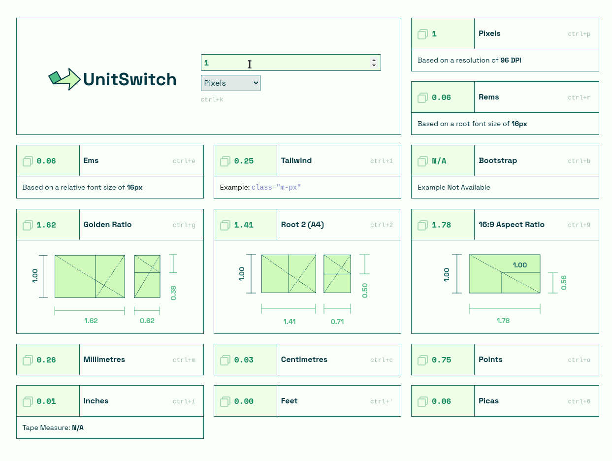

# UnitSwitch

UnitSwitch is a single-page web app that displays several frequently-used equivalents for a specified unit of measurement, as well as some aspect ratios. Keyboard shortcuts are available to copy the desired conversion value to the clipboard.

